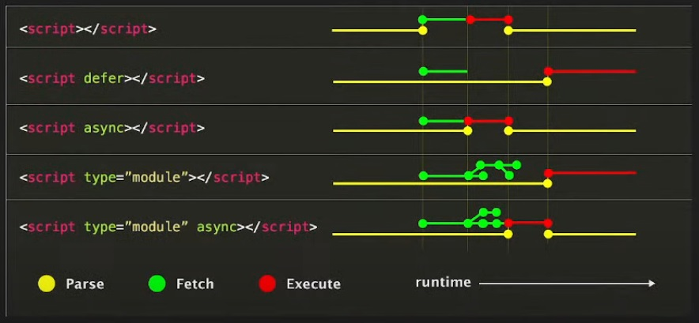

# Clase04

Hoy en la clase vamos a usar script defer.
Como referencia tenemos la siguiente tabla.

## Ejercicios

* Van a crear objetos (usando clases) de los siguientes componentes.
    - Video
    - Audio
    - Botón
    - Lista de elementos

Clase05
https://www.youtube.com/watch?v=eBkKPtPEGSI&list=PL9LIrEiirmm9kpKuLAjXeu7QVXW8cxut6&index=6